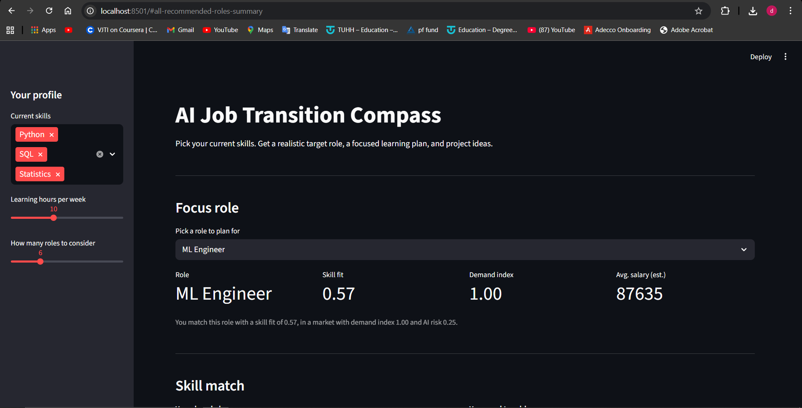
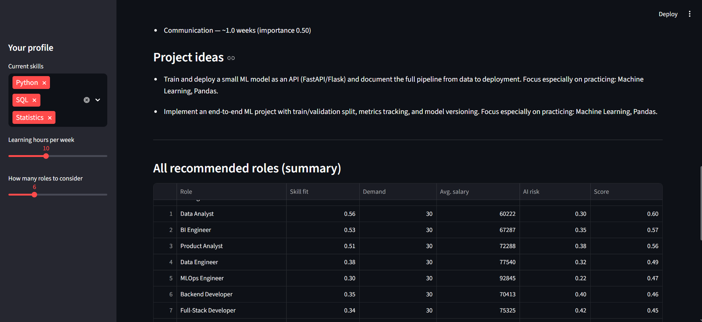
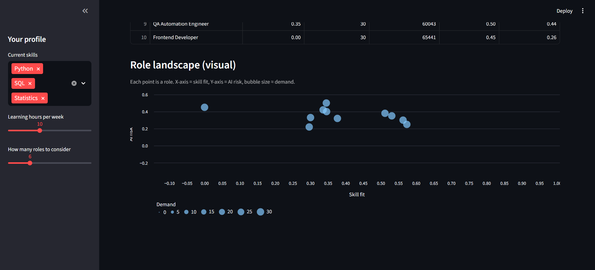

# AI Job Transition Compass 🧭

> Given your current skills, this tool recommends realistic tech roles, highlights missing skills, and generates a focused learning plan with concrete project ideas – weighted by job demand and AI automation risk.

---

## 1. What this project is

This is a small **AI workforce navigation engine** and UI aimed at early-career / junior tech talent.

You:

- Select the skills you actually have.
- The engine:
  - Computes **best-fit roles** (e.g. Data Analyst, Backend Developer, ML Engineer).
  - Weights them by **market demand**, **estimated salary**, and **AI risk**.
  - Shows **which skills you already match** and **which skills you’re missing**.
  - Builds a **phase-based learning plan** and **project ideas** to close the gap.

It’s not a toy classifier on Kaggle; it’s a minimal, explainable pipeline tackling a real problem:  
> *“What role can I realistically move into next, and what exactly should I learn/build to get there?”*

---

## 2. Key features

- 🔍 **Skill-based matching**  
  - Users and roles live in the same **skill vector space**.  
  - Cosine similarity measures how close a user’s skill mix is to each role.

- 📈 **Demand-aware ranking**  
  - Synthetic `job_postings` dataset per role.  
  - For each role, the engine computes:
    - `demand_count` (number of postings)  
    - `demand_norm` (relative demand)  
    - `avg_salary` (average of salary ranges)

- 🤖 **AI risk penalty**  
  - Each role has an `ai_risk_score` (0–1).  
  - Higher risk (more automatable) **lowers** the recommendation score.

- 🧠 **Explainable recommendations**  
  - For the chosen role, the app shows:
    - Top skills you **already match** for that role.
    - Top **missing skills** that matter most.

- 📚 **Learning plan generator**  
  - Missing skills have estimated `difficulty_hours`.  
  - Given weekly learning hours, the engine:
    - Converts to `estimated_weeks`.
    - Groups skills into **Phase 1, Phase 2, ...** (roughly 3–5 weeks per phase).

- 💼 **Portfolio project ideas**  
  - For each role, generates 1–2 **project ideas** that:
    - Directly target missing skills.
    - Are realistic to put on GitHub / a portfolio.

---

## 3. Data & scoring

### 3.1 Core data

All stored as simple CSVs in `data/`:

- `skills.csv`  
  - `skill_id`, `name`, `category`, `difficulty_hours`

- `roles.csv`  
  - `role_id`, `name`, `ai_risk_score`

- `role_skills.csv` (role ↔ skill mapping)  
  - `role_id`, `skill_id`, `importance` (0–1 weight)

- `job_postings.csv`  
  - `job_id`, `role_id`, `title`, `location`, `salary_low`, `salary_high`, `posted_at`  
  - Generated by `generate_job_postings.py` so it can be scaled easily.

### 3.2 Role scoring

For a given user:

1. Build a **user vector** over skills:  
   - `1` if the user has the skill, else `0`.

2. Build **role vectors** using `importance` weights from `role_skills`.

3. Compute **cosine similarity** between the user vector and each role vector.

4. For each role, compute:

```text
score(role) = α * similarity(user, role)
              + β * demand_norm(role)
              - γ * ai_risk_norm(role)
5. Architecture

High-level structure:

CSV data (skills, roles, role_skills, job_postings)
          │
          ▼
  data_loader.py / job_data.py
          │
          ▼
   JobCompassEngine (engine.py)
          │
          ├─ recommend_roles()        -> scoring & ranking
          ├─ explain_role_for_user()  -> matched vs missing skills
          └─ build_learning_plan()    -> phases + projects
          │
          ▼
  - CLI demo (demo_cli.py)
  - Streamlit app (app_streamlit.py)
5. How to run locally
5.1 Setup
# Clone the repo
git clone <YOUR_REPO_URL>
cd ai-job-compass

# Create and activate virtual env
python -m venv .venv
# Windows
.venv\Scripts\activate
# Linux/macOS
# source .venv/bin/activate

# Install dependencies
pip install -r requirements.txt

5.2 Generate job postings (synthetic demand)
# Windows PowerShell
$env:PYTHONPATH = "src"
python -m ai_job_compass.generate_job_postings


This writes data/job_postings.csv with 30 synthetic postings per role (configurable).

5.3 Run the CLI demo
# from project root
$env:PYTHONPATH = "src"
python demo_cli.py


You’ll see a list of skills:

Available skills:
1: Python
5: SQL
18: Git
...


Enter something like:

Enter your skill IDs separated by commas (e.g. 1,5,18):
1,5,18,25


The CLI will print:

Top recommended roles

Why the top role fits (matched / missing skills)

Learning phases

Suggested project ideas

5.4 Run the Streamlit app
$env:PYTHONPATH = "src"
streamlit run app_streamlit.py


Open the URL (usually http://localhost:8501).

Flow:

Use the sidebar to select your skills and weekly learning hours.

The main view shows:

A “focus role” (you can change it via dropdown).

Matched vs missing skills.

Phase-based learning steps.

Project ideas.

A summary table of all recommended roles.

A small “role landscape” visual at the bottom (skill fit vs AI risk vs demand).

 7. Screenshots

 Main screen

Shows skills input, focus role, and skill match summary.




 Learning plan & projects

Phase-based learning steps and concrete project ideas.

[Main screen](docs/screen_main2.PNG)

### Role landscape (optional)

Overview of roles by skill fit, AI risk, and demand.





7. Testing

There is a minimal test suite using pytest in tests/:

pip install pytest
$env:PYTHONPATH = "src"
pytest


Tests cover:

Recommendation pipeline runs without errors for a realistic skill set.

Skill gap outputs non-negative difficulty hours and sensible structure.